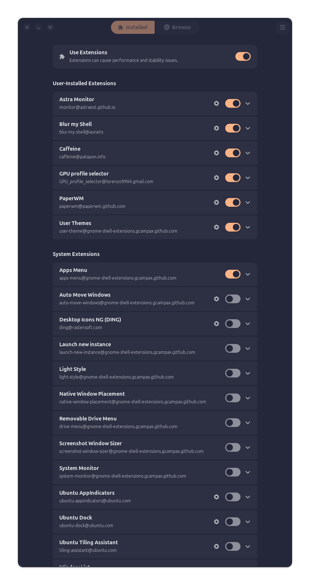
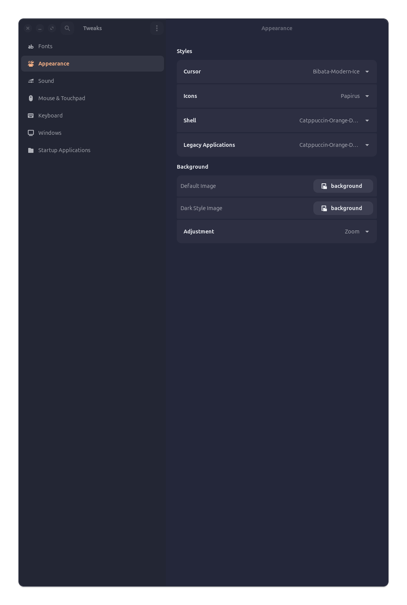
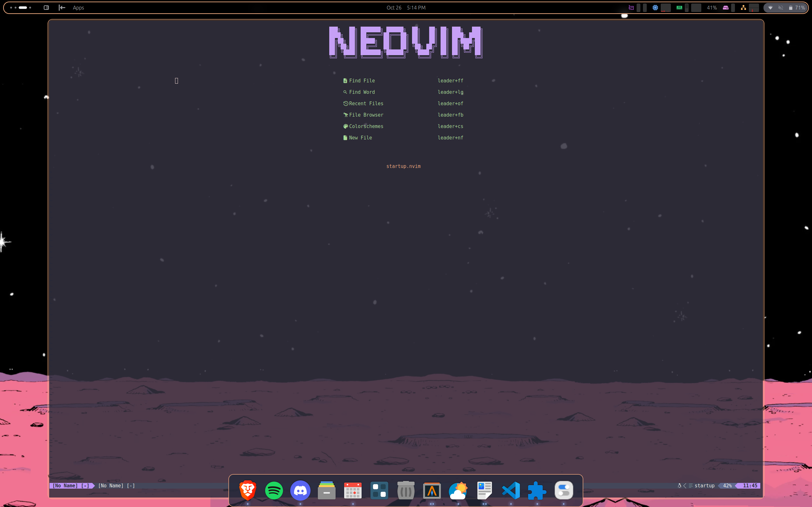

# CHA BOI's RICE 

## Requirements/Dependencies:

gnome extensions:

    sudo apt install gnome-shell-extension-manager
    
gnome tweaks:
    
    sudo add-apt-repository universe
    sudo apt install gnome-tweaks

plank: 

    sudo apt install plank 

### optional Dependencies
alacritty:

    sudo apt install alacritty

neovim:

    sudo apt install neovim 

fish: 

    sudo apt install fish 

## In Gnome Extensions
Install 'User-Themes', 'Blur my Shell", "Astra Monitor", (optional window manager)"paperWM".
If you decide to use paperWM, disable pretty much all of the system extensions cause it will cause some conflicts with paperWM

## In gnome tweaks app 
Go to the appearance tab. 
Set cursor to 'Bibata-Mdoern-Ice'
Set icons to 'Papirus'
Set Shell to 'Catpuccin-Orange-Dark'
Set Legacy Applications to 'Catppuccin-Orange-Dark'

Then go to the start up applications tab and add plank 

## finishing up...
You to move all the files in the .config file into your own which should be 

    ~/.config/ 

The other dot files will need to be in the home directory i.e.

    ~/.themes 
    ~/.icons 
    ~/.fonts 

You'll probably need to restart the computer.

Here's a what the desktop looks like:

 
